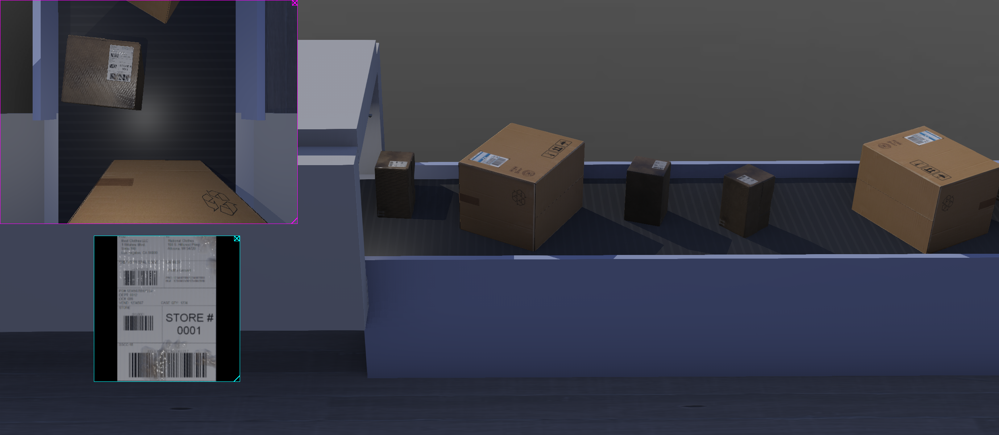

## A document scanner tested in a simulation environment

This project presents a document scanner application that converts images of rectangular documents into a top-down view. To test its capabilities, I developed a simulation using the Webots robotics simulator and OpenCV for image processing and classical computer vision techniques.



The simulation is composed of five important components:

#### 1. A running conveyor belt
The conveyor belt is model provided by Webots to automate the movement of objects across an environment.

#### 2. Cardboard box models
Multiple instances of two cardboard box models running on top of the conveyor belt. The boxes have a document on one of their sides and it's assumed that this face is always pointing up. These reference to the source of these models can be found in the `README.md` files in     the folders `protos/textures/cardboard-*/`.
s
#### 3. Camera
A camera placed on a structure, pointing downwards, towards the conveyor belt.

#### 4. Light sources
- A global light source, to illuminate the environment.
- A light source next to the camera, to illuminate the moving carboard boxes.

#### 5. Document scanner
A document scanner application for processing camera images. It's built with OpenCV, using the following classical Computer Vision techniques:

- Color segmentation in the HSV color space
- Contour detection
- Perspective transform 

The parameters with the most influence on the results are the HSV color threshold values used to segment the documents found in boxes like this one:


Using a simple OpenCV UI, it is possible to find good parameters for segmenting pieces of white paper. In the following image, the gray top part displays the selected lower and upper threshold parameters for HSV thresholding. The bottom part of the image shows the binary image created from the HSV thresholding on the left side and the segmented image on the right side.


## Demo

This demonstration shows how the simulation works. There are two displays: the top left display shows the raw footage from the camera, and the bottom left display shows the rectified document.

https://github.com/ManuelZ/document_scanner_simulation/assets/115771/081c2016-b77b-4e0f-889d-1e3c95975116

The found document may be vertically flipped because no capability has been introduced to understand the content of the paper. It is only oriented so that the long side is positioned vertically.


## Observations

Testing this app in a simulation revealed that the following variables can influence its efficacy:

- The HSV threshold values
Finding a good set of HSV threshold values is only possible if all the documents have predominantly the same color, such as white.

- Intensity and direction of light sources
Thresholding can be affected by the direction and intensity of the light sources illuminating the scene.

- Size of the box model
To avoid false positives, some rules are used to filter out erroneous detections, such as filtering by area. If the boxes are too short and the camera is placed too high, the detected documents will have a small size in the photo, which could lead to them being mistakenly filtered out.

- Size of the document
If there are multiple documents of different sizes, this must be accounted for (along with the vertical distance from the camera to the document) to identify the smallest documents available.

- Model texture of the box:
There are features in the labeled boxes that could introduce some complexity in the detection of the documents, for example:
    - Lines due to the inherent texture of corrugated cardboard
    - Wrinkles in plain cardboard
    - Reflections due to the material of the box (some include a "metalness" texture to mimic plastic)

- Orientation of the documents as viewed from the camera
Boxes can appear rotated in different orientations, although for simplicity it's assumed that all labels appear in the top plane of the boxes, this plane can still appear arbitrarily rotated, making it harder to identify the correct orientation of the final warped document.

- Other figures or symbols present in the box
The contour detection step relies on finding quadrilateral blobs. If there are squared figures or symbols present in the boxes, these could be mistakenly identified as documents.

- Distance between boxes
The detection process expects to find a single document per image. If two or more boxes appear in the image, this could prevent the correct identification of the document corresponding to a box.

- Position of the camera
The position of the camera has an influence on what the camera perceives. A correct positioning could prevent surrounding objects or shadows from interfering with the detection.

- Camera parameters
The field of view of the camera significantly affects the image. Multiple fields of view and resolutions of commercial cameras can be tested to find the best results by adjusting these parameters before running the simulation. Some of these camera parameters include:
    - Field of view
    - Image resolution
    - Lens distortion
    - Lens flare 
    - Bloom

## Requirements and versions
- Python 3.11
- Webots 2023b
- OpenCV 4.9
- Numpy
- imutils


## Using a Conda environment with Webots
Create a Conda environment with the required libraries and launch Webots from within the activated environment.

```
(opencv) $ webots .
```

## A cardboard box model

Using high quality models to produce realistic simulations can help one identify potential situations that could have an impact on the document detection performance. Here I explain the process that I went through while exploring the realm of 3D mesh modeling and texturing.

I downloaded cardboard box model [from Sketchfab](https://sketchfab.com/3d-models/cardboard-box-58db7bc84fe64eb990f851b9e50fab5c):


The model came in the `.fbx` format but Webots can only open Collada (`.dae`) or Wavefront (`.obj`) files. I used Blender to import the `.fbx` file, assign the available textures and export it in the Wavefront format. However, when I loaded the model in Webots, the model looked dull, and unlike the Sketchfab preview. I suspected the texture files were not being loaded correctly. I'm inexperienced with 3D mesh modeling and texturing, so I had trouble understanding the purpose of each file. There were 4 PNG texture files:

- BaseColor
- Roughness
- Normal
- Height

A Google search led me to a relevant [Robotics Stackexchange post](https://robotics.stackexchange.com/questions/24932/cant-make-new-cadshape-models-have-the-same-appearance-as-previous-pbrappearanc). This post made me think that out of the two formats that Webots is capable of loading (Wavefront and Collada), I would probably have better chances with the Wavefront file if I wanted to be able to use these textures.

## The Wavefront format

After loading the `.fbx` in Blender I had something like this:


When Blender exports a model in the Wavefront format, it creates a `.obj` and a `.mtl` file. The `mtl` file is a materials file which looks like this:

```
# Blender 4.1.1 MTL File: 'box.blend'
# www.blender.org

newmtl Material1
Ks 0.500000 0.500000 0.500000
Ke 0.000000 0.000000 0.000000
Ni 1.500000
d 1.000000
illum 2
Pm 0.000000
Ps 0.000000
Pc 0.000000
Pcr 0.030000
aniso 0.000000
anisor 0.000000
map_Kd CardboardBox_Low_DefaultMaterial_BaseColor.png
map_Pr textures/CardboardBox_Low_DefaultMaterial_Roughness.png
map_Bump -bm 1.000000 textures/CardboardBox_Low_DefaultMaterial_Normal.png
```

The `.obj` file references the `.mtl` file, and when Webots' `CadShape` node loads the Wavefront file, it parses the `.mtl` file and extracts the material information.

Here are the lines that point to the files I defined in Blender:
```
map_Kd textures/CardboardBox_Low_DefaultMaterial_BaseColor.png
map_Pr textures/CardboardBox_Low_DefaultMaterial_Roughness.png
map_Bump -bm 1.000000 textures/CardboardBox_Low_DefaultMaterial_Normal.png
```

For some reason, the Height file was not referenced.

The first problem I encountered was this warning from Webots, and no box model shown:
```
WARNING: CardboardBox2 "solid" > Transform  > CadShape : Invalid data, please verify mesh file: Cannot parse string "niso" as a real number: does not start with digit or decimal point followed by digit.
```

This was easy to solve, I just deleted the following two lines from the `.obj` file:
```
aniso 0.000000
anisor 0.000000
```

The model loaded without further warnings, but it still didn't look right. By removing each of these lines one by one and reloading the simulation, I saw the effect of each on the rendered model.


1) The box using only the mapped BaseColor texture:


2) The box using the mapped BaseColor texture and the mapped Roughness texture:


3) The box using the mapped BaseColor and Normal textures didn’t show any difference.


## Inspecting the Webots CAD loading code

To understand why the Normal texture wasn't affecting the appearance, I inspected the C++ Webots code for the `CadShape` component. I found that four arrays were being filled with data from the loaded CAD file:

```C++
for (size_t j = 0; j < mesh->mNumVertices; ++j) {
    
    // extract the coordinate
    const aiVector3D vertice = transform * mesh->mVertices[j];
    coordData[currentCoordIndex++] = vertice[0];
    ...
    
    // extract the normal
    const aiVector3D normal = transform * mesh->mNormals[j];
    normalData[currentNormalIndex++] = normal[0];
    ...
    
    // extract the texture coordinate
    if (mesh->HasTextureCoords(0)) {
        texCoordData[currentTexCoordIndex++] = mesh->mTextureCoords[0][j].x;
        ...
    } 
    ...

    // create the index array
    for (size_t j = 0; j < mesh->mNumFaces; ++j) {
        const aiFace face = mesh->mFaces[j];
        ...
        indexData[currentIndexIndex++] = face.mIndices[0];
        ...
    }
}
```
(Modified for brevity from the [Webots CadShape code](https://github.com/cyberbotics/webots/blob/1c6c9a38e7351d3c586e15ff039b26aa53033a7b/src/webots/nodes/WbCadShape.cpp#L440))

The code appears to load mesh vertices, mesh normals, one texture map and faces indices. Despite the normals map data being loaded, it didn’t affect the model's appearance. Why don't I see any difference when using it? And, which part of the code is really loading the `mesh` data?

Looking through the Webots code [I found](https://github.com/cyberbotics/webots/blob/1c6c9a38e7351d3c586e15ff039b26aa53033a7b/dependencies/Makefile.linux#L13) that Webots uses the Assimp library to load CAD data. Searching Assimp's GitHub issues related to `.obj` files and normal maps, I found several issues: [issue 1](https://github.com/assimp/assimp/issues/1121) [issue 2](https://github.com/assimp/assimp/issues/430), [issue 3](https://github.com/assimp/assimp/issues/3726). There I discovered that changing `map_Bump` to either `Map_Kn` or `norm` resolved the issue:


The texture mapping lines now looked like this:
```
map_Kd textures/CardboardBox_Low_DefaultMaterial_BaseColor.png
map_Pr textures/CardboardBox_Low_DefaultMaterial_Roughness.png
norm textures/CardboardBox_Low_DefaultMaterial_Normal.png
```

I tried using the available height texture with the following line, but it had no effect:
```
disp textures/CardboardBox_Low_DefaultMaterial_Height.png
```

I don't think that Webots it's able to load this type of texture. I might be wrong, but the Stackexchange post mentioned that the Webots [PBRAppearance](https://cyberbotics.com/doc/reference/pbrappearance) node allows more control than `CadShape`, listing the following supported texture maps, where there is no height or bump texture mentioned.

- baseColorMap
- roughnessMap
- metalnessMap
- normalMap
- occlusionMap
- emissiveColorMap


## Conclusion

This document scanner application demonstrated the ability to transform images of rectangular documents into a top-down view within a simulated environment using Webots. The simulation setup included a conveyor belt, cardboard box models, a downward-facing camera, and light sources, all of which contributed to test the accuracy and reliability of the document scanner. The scanner utilized OpenCV for image processing, employing techniques such as color segmentation in the HSV color space, contour detection, and perspective transform.

Several variables were found to influence the scanner's efficacy, including HSV threshold values, light intensity and direction, box and document sizes, model textures, document orientation, presence of other figures, distance between boxes, camera position, and camera parameters. In real-world applications, it's essential to identify which variables you can control and adjust them to compensate for the variables that are beyond your control. By fine-tuning the controllable factors, such as the camera position, HSV threshold values, local light intensity and direction, one can mitigate the impact of uncontrollable elements, like global lighting conditions and the presence of other environment objects.

The experiment also highlighted the challenges faced when working with 3D mesh modeling and texturing, particularly in converting and importing models from different formats and using them in a simulator.

Overall, the project provided valuable insights into both the capabilities and limitations of this document scanner version in a controlled simulation environment and the complexities of 3D modeling and texturing for realistic simulations.